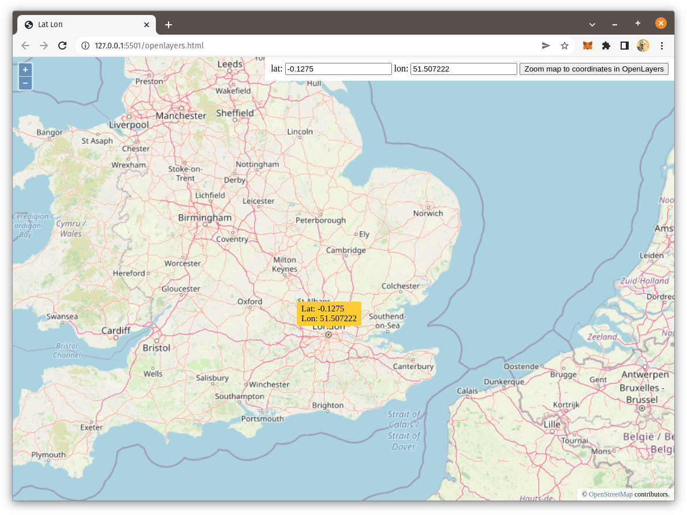

# ZoomMapToLatLongInOpenLayers
Implement Zoom-map-to-lat-long-in-OpenLayers.

## For tutorial post, click on following link 
[Implement Zoom map to lat long in OpenLayers.](https://spatial-dev.guru/2022/07/01/zoom-map-to-lat-long-in-openlayers/"")
